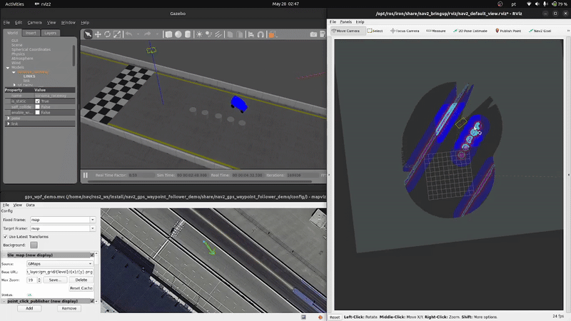

# AIR-UFG | Twizy Autonomous Navigation

## Overview

This project focuses on applying navigation frameworks to control a simulated version of the Twizy vehicle, provided by StreetDrone, equipped with a full set of sensors. As the project is still under development, we initially decided to use the Navigation2 framework to evaluate the performance of autonomous navigation in a well-defined environment, such as a closed parking lot.

---

## Table of Contents
* [Overview](#overview)
* [Installation](#installation)
* [Usage](#usage)
* [Configuration](#configuration)
* [Modifications to External Components](#modifications-to-external-components)
* [Licensing](#licensing)
* [Some of the work in development](#some-of-the-work-in-development)

---

## Installation

The installation procedure is very simple; you just need to build the Docker image using the Dockerfile provided in this repository.

1.  **Clone the repository:**
    ```bash
    git clone https://github.com/AIR-UFG/air_twizy_navigation.git
    cd air_twizy_navigation
    ```

2.  **Build the Docker image:**
    ```bash
    docker build -t sim_test .
    ```
    *You can change the image name, but remember to **also** change it in the `run_compose.sh` script.*

---

## Usage

After building the Docker image, you can simply run the `run_compose.sh` script, which will set up the container with all the required configurations.

1.  **Execute the shell script:**
    ```bash
    ./run_compose.sh
    ```

2.  **Access** the launched container:
    ```bash
    docker container exec -it air_container bash
    ```

3.  **Run the simulation:**

    To run the simulation, you need to execute the following commands inside the container. You will need **multiple terminal sessions**; to open them, run the previous `docker container exec` command in several terminals.

    This first set of commands is needed if you have made changes in the repository:

    ```bash
    # Ensure changes in the source code are loaded
    colcon build --packages-ignore nav2_costmap_2d
    MAKEFLAGS="-j2" colcon build --packages-select nav2_costmap_2d
    ```

    Launch the simulation:
    ```bash
    ros2 launch air_sim air_simulation.launch.py
    ```

    Wait for the world to load and then run (if the Twizy model wasn't loaded):
    ```bash
    ros2 run gazebo_ros spawn_entity.py -entity sd_twizy -topic robot_description -x 0 -y 0 -z 1.0
    ```
    After that, launch the following commands, each in one of the remaining terminals connected to the container:

    ```bash
    ros2 launch sd_vehicle_interface sd_vehicle_interface.launch.xml
    ```

    ```bash
    ros2 launch nav2_gps_waypoint_follower_demo nav2_init.launch.py
    ```

---

## Configuration

The configuration files can be found in the `nav2_gps_waypoint_follower_demo` package, inside the `config` directory. The following files are available:

1.  *`demo_waypoint.yaml`*: You can store waypoints here for the robot to follow (**Currently, this feature has not been tested**).

2.  *`dual_ekf_navsat_params.yaml`*: This file configures the `robot_localization` package nodes responsible for fusing IMU and GPS measurements, creating a TF (Transform) chain that replaces AMCL.

3.  *`gps_wpf_demo.mvc`*: This file is used to configure Mapviz.

4.  *`nav2_no_map_params.yaml`*: This file contains the overall Nav2 configuration. It determines which behavior tree, controller, and path planner are used, along with the costmap configurations.

    **IMPORTANT**: Some parameters for the local and global costmaps **might not** work if set here because they were **hardcoded** due to issues encountered during development. These parameters are:

    * `min_obstacle_height`
    * `max_obstacle_height`
    * `obstacle_max_range`
    * `obstacle_min_range`
    * `raytrace_max_range`
    * `raytrace_min_range`

---

## Modifications to External Components

This project incorporates and utilizes modified versions of open-source software components. Changes were made to meet the specific requirements of this project and optimize performance for the proposed application.

### Nav2 - `nav2_costmap_2d`

* **Original Software:** `nav2_costmap_2d` (part of the [Nav2 - Navigation2 stack](https://navigation.ros.org/)).
* **Original Licenses:** Apache License 2.0 and BSD-3-Clause.
* **Copyright Notices:** Original copyright notices have been retained in the modified source files.

#### Source Code Modifications:

* **`ros_packages/navigation2/nav2_costmap_2d/src/observation_buffer.cpp`**:

    * Hardcoded the **aforementioned** costmap parameters.


### Nav2 - `nav2_gps_waypoint_follower_demo`

* **Original Software:** `navigation2_tutorials/nav2_gps_waypoint_follower_demo` ([here's the source link](https://github.com/ros-navigation/navigation2_tutorials/tree/rolling/nav2_gps_waypoint_follower_demo)).

* **Copyright Notices:** Original copyright notices have been retained in the modified source files.

#### Source Code Modifications:

* **`ros_packages/navigation2_tutorials/nav2_gps_waypoint_follower_demo/launch/`**:

    * Changed `gps_waypoint_follower.launch.py` and created `nav2_init.launch.py` to work with the Twizy simulation.

* **`ros_packages/navigation2_tutorials/nav2_gps_waypoint_follower_demo/worlds/sonoma_raceway.world`**:

    * Changed `real_time_update_rate` and `max_step_size` because they were conflicting with the Twizy model.

---

## Licensing


* **Third-Party Components:**
    This project utilizes third-party components, such as `nav2_costmap_2d` from Nav2, which are licensed under their own terms (Apache 2.0 and BSD-3-Clause, as detailed in the "Modifications to External Components" section). Efforts have been made to fully comply with these licenses, including the retention of copyright notices and the indication of modifications. 

---
---

## Some of the work in development

As mentioned in the Overview, this work aims to apply the Navigation2 framework to the drive-by-wire StreetDrone development for the Renault Twizy. This is achieved through the `sd_vehicle_interface`, which provides us with an interface to control the car using linear and angular velocity setpoints.

To begin our experimentation, we started with our ROS2 Twizy simulation. To evaluate how Nav2 can control the SD-Twizy in an open environment, such as an empty parking lot, we decided to initially focus on GPS-based navigation. This approach provides a strong starting point for open environments for several reasons. Unlike conventional methods that rely on features like walls or landmarks for localization (which are often absent in large, open areas), GPS offers a global positioning system. This simplifies the initial setup in feature-sparse environments. However, we recognize that GPS data can be prone to errors and inaccuracies. Therefore, while GPS forms the initial basis of our navigation strategy, we plan to integrate SLAM (Simultaneous Localization and Mapping) techniques in the future. This will allow us to fuse GPS data with local sensor information, correcting for potential GPS errors and achieving a more robust and precise localization solution for our definitive navigation system.

Since the simulation model does not perfectly replicate the real Twizy, we applied several modifications to the `vehicle_control` plugin and other related files. These changes ensure that our model accurately tracks the linear and angular velocity setpoints. Our underlying assumption is that if the real car can follow the velocity setpoints with the same precision as in the simulation (assuming a geometric match), then a system proven effective in simulation can be transferred to the real world with further tuning and adjustments based on real-world proportions.

Following this approach, we first achieved our initial goal of accurately tracking velocities within the simulation. Subsequently, we adapted the Nav2 GPS tutorial to our specific vehicle. Currently, we are in the process of fine-tuning the Nav2 parameters and exploring other plugins, paving the way for the eventual integration of SLAM, to develop the optimal navigation system for our intended purpose.

Here is our current result:


